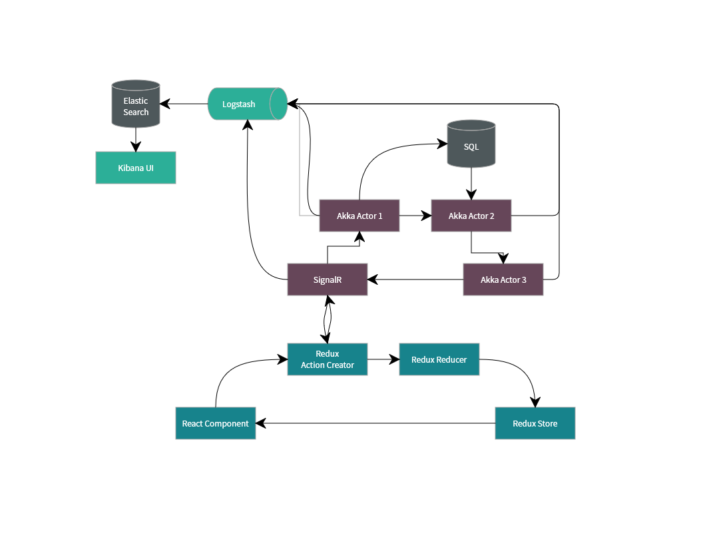

# Preface

This is a demo application that is meant to showcase a number of technologies. This is a complex architecture that is overkill for most problems.

# Requirements

In order to run this application, you need:

* Docker

In order to build and develop, add:

* .NET Core
* Node
* Yarn (`npm install -g yarn`)
* MS SQL Local (MSSQLLocalDb - installed with Visual Studio)

## Technologies

Technologies in play include:

* Docker
* Akka
* ASP.NET Core
* SignalR
* React and Redux
* ELK Stack
* Entity Framework
* Microsoft SQL Server

## Running the Application

In order to build the application, run:

`docker-compose up`

That should be it.

## Building the application

Open in visual studio. Run.

That's it.

## Interesting URLs

### When hosting within Docker

| Role   | Url                   |
| ------ | --------------------- |
| Web    | http://localhost:8000 |
| API    | http://localhost:8001 |
| Kibana | http://localhost:5601 |
| SQL    | localhost,1434        |

### When hosting locally

| Role | Url                    |
| ---- | ---------------------- |
| Web  | Assigned by VS         |
| API  | Assigned by VS         |
| SQL  | (localdb)\MSSQLLocalDb |

Kibana is not present when hosting locally. See consoles instead.

## Front-end

The front-end is contained within `Dockka.Web\ClientApp`, and uses React and Redux.
